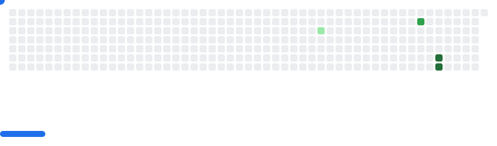

# 🧑‍💻 About me 

### Hey there! 👋

I'm Josh, an Undergraduate Computer Science student in Gadjah Mada University!

- 🔭 I’m currently working on mini-project using SQL programming language in Google Colab for my bootcamp Intelligo.ID!
- 🌱 Currently learning: Data using **SQL** and **C++** for University Project!
- 🛠 Tools I use: VS Code, XCode, Google Colab, macOS terminal workflows.
- 🚀 2025 Goals: Master Python and C++
- ⚡ Fun fact: I love cats and I also enjoy solving CTF puzzles (Cryptography & Forensics)!

  

📫 Let's Connect:
- 💼 [LinkedIn](https://www.linkedin.com/in/josh-vincent-soh-5a265b379/)
- 📊 [Kaggle](https://www.kaggle.com/joshvincentsoh)
- 🐍 [GitHub](https://github.com/jovinsoh16)

---

## 🌟 Featured Projects

### 🎮 Higher or Lower Game C++
A simple guessing game using rand() and modular to generate random numbers!

View the project by clicking the image!

#### What I learned:

- Random number generation and seeding with srand(time(0))

- Control flow using loops (while, do...while) and conditionals

- User input/output handling with cin and cout

- Formatting and alignment with setw() for cleaner UI

- Implementing scoring systems and level progression

- Using chrono and this_thread::sleep_for for countdowns and delays

---

## 🧑‍💻 Activity

<picture>
  <source media="(prefers-color-scheme: dark)" srcset="breakout-images/breakout-dark.svg" />
  <source media="(prefers-color-scheme: light)" srcset="breakout-images/breakout-light.svg" />
  
</picture>
